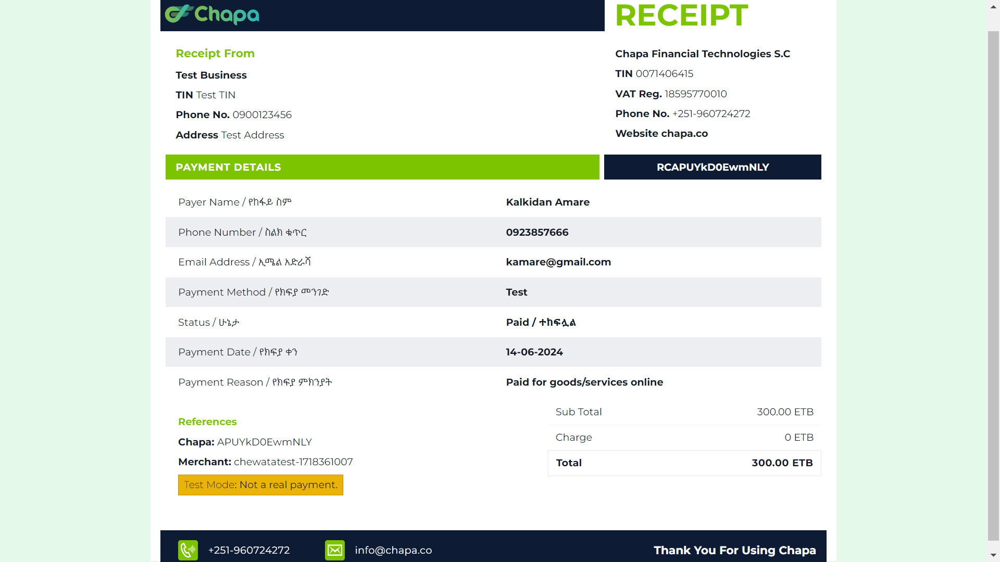

# Udemy Clone Django Project

This project is a Django-based web application that emulates core functionalities of Udemy, a popular online learning platform. The application supports user registration, authentication, course management, and payments.

## Table of Contents

- [Features](#features)
- [Images](#images)
- [Installation](#installation)
- [Configuration](#configuration)
- [Usage](#usage)
- [Contributors](#contributors)

## Features

- User Registration and Authentication
- Course Management (Create, Read, Update, Delete Courses)
- Video and PDF uploads for Courses
- User-specific course lists
- Search functionality
- Payment processing for courses(Integrated with CHAPA)

## Images

### Payment Receipt

### The Landing Page

## Usage

### User Registration and Authentication

- Users can register by visiting the signup page.
- After registering, users can log in to the application.
- Admin users can access the Django admin interface at `/admin/`.

### Course Management

- Admin users can create and manage courses through the Django admin interface.
- Users can view a list of courses, search for courses, and add courses to their personal list.

### Payment Processing

- Users can pay for courses. The payment processing is handled through CHAPA by simple form that captures necessary details.

## Contributors

- [Kalkidan Amare](https://github.com/Kalkidan-Amare)
- [Kidus Asebe](https://github.com/Kad-19)
- [Kidus Berhane](https://github.com/Kidusbk)
- [Kidus Hawoltu](https://github.com/KidusHawoltu)
- [Kirubel Legesse](https://github.com/Proffesorgreen)
- [Kirubel Wondwoson](https://github.com/Kirubel-wondwoson)
